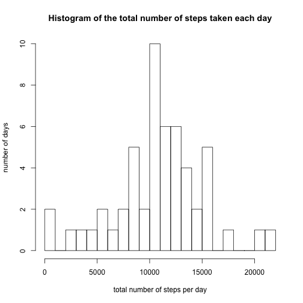
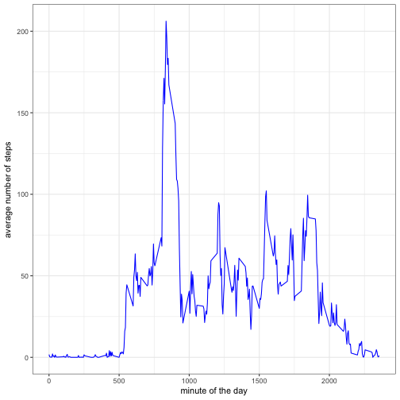
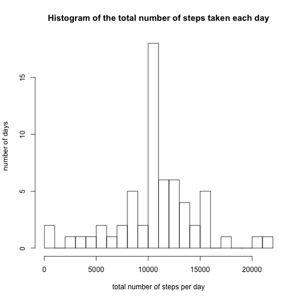
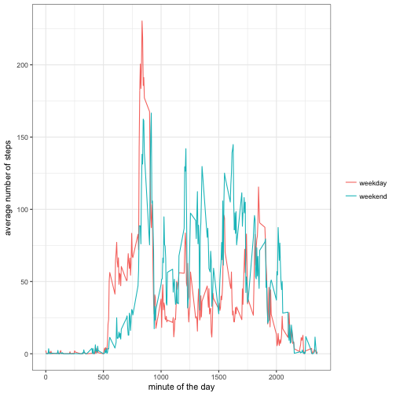

# Reproducible Research Project 1


```r
#packages needed for the program
library(dplyr)
library(ggplot2)
```

## 1. Code for reading in the dataset and/or processing the data

```r
activity <- read.table("./activity.csv", header = TRUE, sep = ",")
activity$date <- as.Date(activity$date, "%m/%d/%y")
```

## 2. Histogram of the total number of steps taken each day

```r
#Calculate sum of steps taken each day
steps_day <- activity %>% group_by(date) %>% summarise(steps_day =sum(steps))
steps_day <- steps_day[order(steps_day$date),] 
#make plot
hist(steps_day$steps_day, breaks = 30,
     xlab = "total number of steps per day", 
     ylab = "number of days", 
     main = "Histogram of the total number of steps taken each day")
```



## 3. Mean and median number of steps taken each day

```r
        # (according to the explanation in the assignment,
        # mean and median of the total number of steps taken per day)
mean_sday <- mean(steps_day$steps_day, na.rm = TRUE)
median_sday <- median(steps_day$steps_day, na.rm = TRUE)
```
Mean of number of steps taken each day is 1.0766189 &times; 10<sup>4</sup>  
Median of number of steps taken each day is 10765  

## 4. Time series plot of the average number of steps taken


```r
        #Make a time series plot (i.e. 𝚝𝚢𝚙𝚎 = "𝚕") of
        #the 5-minute interval (x-axis) and the average number of steps taken, 
        #averaged across all days (y-axis)
#average steps accorss all days:
steps_5min <- activity %>% group_by(interval) %>% summarise(steps_5min =mean(steps, na.rm=TRUE))

#make plot
ggplot(steps_5min, aes(interval, steps_5min))+
        geom_line(colour = "blue") +
        theme_bw() +
        xlab("minute of the day") + ylab("average number of steps")
```




## 5. The 5-minute interval that, on average, contains the maximum number of steps


```r
max_int <- steps_5min[which.max(steps_5min$steps_5min),]
paste ("Interval with maximum number of steps = ",max_int[1])
```

```
## [1] "Interval with maximum number of steps =  835"
```

## 6. Code to describe and show a strategy for imputing missing data

First, calculate the total number of missing values

```r
       # Calculate and report the total number of missing values
sum(is.na(activity))
```

```
## [1] 2304
```

Then, fill in the missing values using the mean for that 5-minute interval


```r
#add a column to activity df with the mean for each 5-mean interval
a <- merge(activity,steps_5min)
a <- rename(a, average_all_days = steps_5min)

#replace the NA values by the 5min average in its row
#using an index vector that identifies the na values in steps column

a$steps <- replace (a$steps, which(is.na(a$steps)), a$average_all_days[which(is.na(a$steps))])

#Create a new dataset that is equal to the original dataset
# but with the missing data filled in (activity_nona).

activity_nona <- select(a, -average_all_days)
activity_nona <- activity_nona[,c(2,3,1)]
activity_nona <- activity_nona[order(activity_nona$date,activity_nona$interval),] 
```


## 7. Histogram of the total number of steps taken each day after missing values are imputed

```r
##Calculate sum of steps taken each day with activity_nona
steps_day_nona <- activity_nona %>% group_by(date) %>% summarise(steps_day =sum(steps))
steps_day_nona <- steps_day_nona[order(steps_day_nona$date),] 

#make plot
hist(steps_day_nona$steps_day, breaks = 30,
     xlab = "total number of steps per day", 
     ylab = "number of days", 
     main = "Histogram of the total number of steps taken each day")
```




```r
#Report Mean and median
mean_sday_nona <- mean(steps_day_nona$steps_day)
median_sday_nona <- median(steps_day_nona$steps_day)
```
Mean of number of steps taken each day is 1.0766189 &times; 10<sup>4</sup>  
Median of number of steps taken each day is 1.0766189 &times; 10<sup>4</sup>

Do these values differ from the estimates from the first part of the assignment?
What is the impact of imputing missing data on the estimates of the total daily number of steps?
In this case, very similar results were obtained when imputing missing data with average number of steps in each 5-min interval accross all dates than when missing values where ignored. The election of the mean of steps of the same interval of the day should be a very approximate estimate of the actual values, and should reduce the impact of not having the value when caltulating data statistics.  

## 8. Panel plot comparing the average number of steps taken per 5-minute interval across weekdays and weekends

```r
#add column with the factor weekday_weekend
wd <- mutate (activity_nona, weekday_weekend = weekdays(activity_nona$date))
wd$weekday_weekend <- sub("Saturday|Sunday","weekend", 
                sub("Monday|Tuesday|Wednesday|Thursday|Friday","weekday",wd$weekday_weekend))
steps_5min_wd <- wd %>% group_by(interval,weekday_weekend) %>% summarise(steps_5min = mean(steps))

#make plot
ggplot(steps_5min_wd, aes(interval, steps_5min,color=weekday_weekend)) + 
        geom_line() +
        theme_bw() +
        theme(legend.title = element_blank())+
        xlab("minute of the day") + 
        ylab("average number of steps")
```




## 9. All of the R code needed to reproduce the results (numbers, plots, etc.) in the report

(See above)
